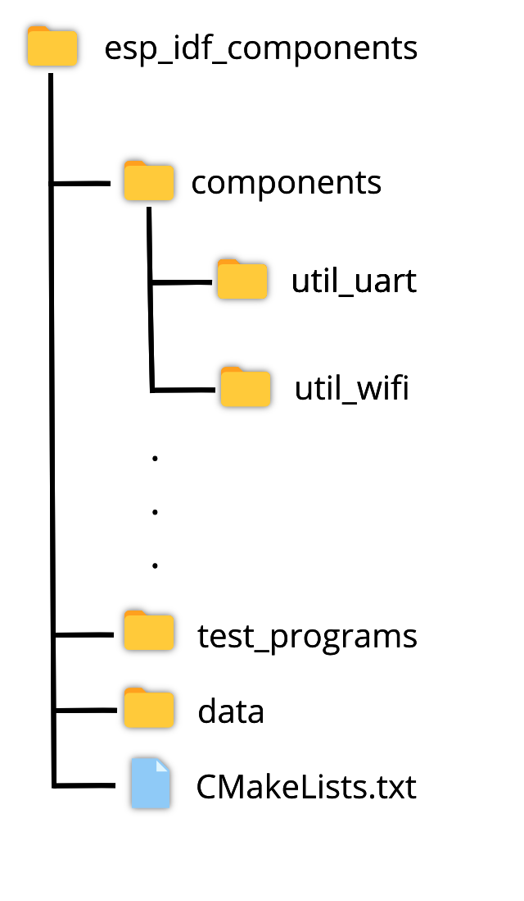
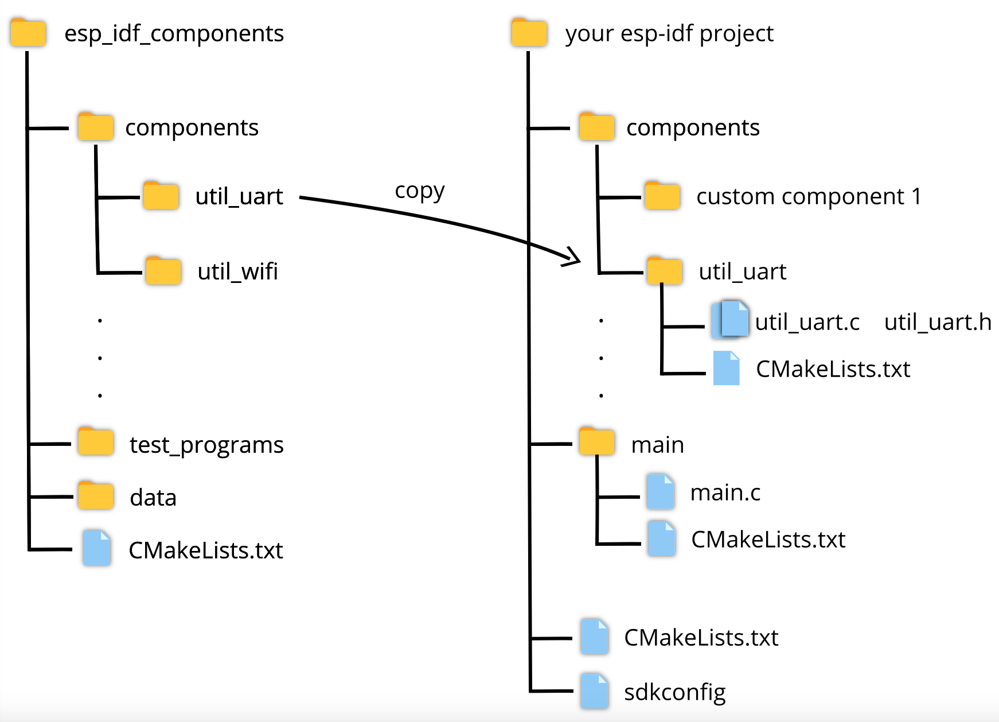
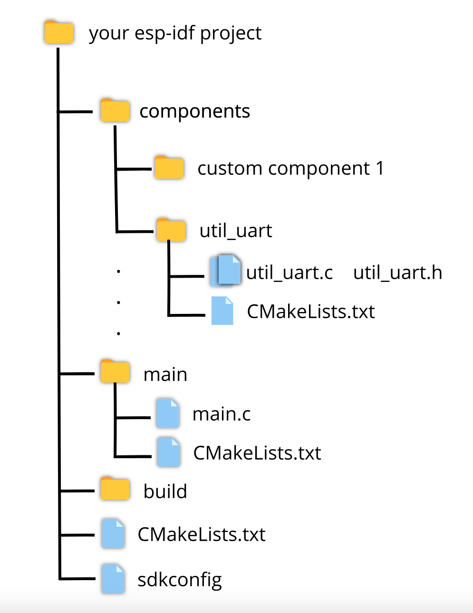

---

### ESP-IDF COMPONENTS

This project is aimed at providing utility libraries that are built upon ESP-IDF APIs to allow rapid development of ESP-IDF applications.

---

### Structure of repository

---

### How to use components from this project ?

1. Download the latest version of this project.
2. From the `esp_idf_components/components` directory copy the required component directory; paste the directory in your esp-idf project's component directory.

For example, lets say you have to use the `util_uart` component in your project then you will have to do the following :

 

---

### General Structure of an ESP-IDF project

 

---

### Currently, available components

* `util_uart` : Utility functions for using the uart port of an esp32 SoC
* `util_wifi` : Manage and control WiFi functionality using this component
* `util_nvs` : Utility functions for accessing the NVS storage
* `file_manager` : Utility functions for accessing spiffs storage
* `cryptography` : Utility function for performing common cryptographic operations
* `vispr` : Implement `[vispr](https://github.com/parmAshu/vispr.git)` protocol using this component